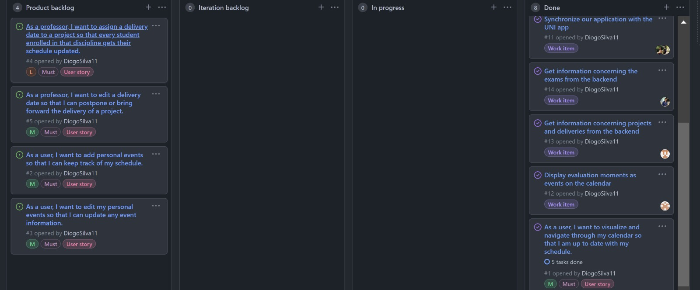

## Completed issues
---
* Synchronize the calendar inside the application;
* Get information concerning the exams from the backend;
* Get information concerning projects and deliveries from the backend;
* Display evaluation moments as events on the calendar;
* As a user, I want to visualize and navigate through my calendar so that I am up to date with my schedule;

## Iteration retrospective 
---
1. What went well?  
We accomplished the goals previously set and all agreed that the size of the iteration was appropriate.
  
2. What should we do differently?  
We should improve the management/distribution of our processes regarding the project's code.
  
3. What still puzzles us?  
The release of the APK raised some concernings due to the implementation within the UNI project 

## Github Panel

  

